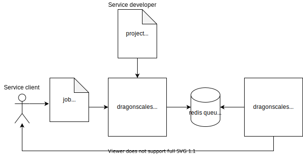

# dragonscales :dragon:

`dragonscales` is a highly customizable asynchronous job-scheduler framework. This framework is used to scale the execution of multiple tasks by multiple clients. A developer can expose several predefined tasks that are available to the clients through a jobs service, without the need to build the job system itself.

## Usage

<p align="center">
    <br>
    Figure 1: <em>The interaction of both the developer and the client with the framework.</em>
</p>

### Service developer

As the developer, you need to provide the service with the tasks that will be available for the clients to run.

For each task you want to expose, a [BaseTask](dragonscales/tasks.py) subclass must be created. The `run` method is invoked to execute the task. The following is a basic example of a [Task](tests/tasks/task.py):

```python
class Task(tasks.BaseTask):
    def run(self):
        return {"key": "value"}
```

Once the `Task` finishes its execution, the results will be stored in a given location. For each storage location, a [BaseStorage](dragonscales/storages.py) subclass must be created. The `store` method writes the results in a certain location, and returns its location information. Again, the following is a basic example of a [Storage](tests/storages/storage.py):

```python
class Storage(storages.BaseStorage):
    def store(self, result):
        storage_path = "/tmp/dragonscale.storage"
        with open(storage_path, "w") as storage_file:
            storage_file.write(json.dumps(result))
        return {"path": storage_path}
```

Since the framework is asynchronous, the callback is in charge of returning the results' location to the client. For each callback method, a subclass of [BaseCallback](dragonscales/callbacks.py) must be created. The `call` method sends the location information to the client. And once a again, a basic [Callback](tests/callbacks/callback.py) example is shown below.

```python
class Callback(callbacks.BaseCallback):
    def call(self, location):
        callback_path = "/tmp/dragonscale.callback"
        with open(callback_path, "w") as callback_file:
            callback_file.write(json.dumps(location))

```

If you decide you want to add some authorization step for the clients to access the service, you must implement a [BaseAuthorizer](dragonscales/authorizers.py) subclass. See this basic [Authorizer](tests/authorizers/authorizer.py) example.

---

Once you're done with all the previous implementation steps, there is only one thing left to do: Create a `dragonscales` project file with your tasks, storages, callbacks, and authorizer, along with the path to their respective modules and constructor arguments. You also need to list the names of all the queues that will be available in the jobs system.

The path to the project file must be exported with the environment variable `DRAGONSCALES_PROJECT_PATH`. A basic example of a project file can be found in [here](tests/projects/test.json).

### Service client

Once the service is up and running (see installation and setup instructions below), the clients can run a task by requesting the service to queue a job for that task. The client invokes the `/api/v1/jobs` endpoint to specify a specific task, storage, and callback among the available ones - each one defined by its name and parameters. See this [job request](tests/jobs/test.json) as an example.

## Installation

```bash
$ sudo apt install virtualenv redis
$ virtualenv env
$ source ./env/bin/activate
$ pip install .
```

## Setup

```bash
$ cp tests/projects/test.json project.json
$ vim project.json # edit it with your own queues, tasks, etc
```

## Running the service

Run the redis server:

```bash
$ redis-server
```

For each queue specified in the project file, run a worker:

```bash
$ export DRAGONSCALES_QUEUE_URL=redis://localhost:6379
$ export DRAGONSCALES_QUEUE_NAME=queue
$ ./dragonscales-worker.sh
```

Finally, run the jobs service:

```bash
$ export DRAGONSCALES_LOGGER_LEVEL=DEBUG
$ export DRAGONSCALES_LOGGER_PATH=dragonscales.log
$ export DRAGONSCALES_LOGGER_MAX_BYTES=1048576
$ export DRAGONSCALES_PROJECT_PATH=project.json
$ export DRAGONSCALES_SERVICE_ADDRESS=0.0.0.0:5003
$ export DRAGONSCALES_QUEUE_URL=redis://localhost:6379
$ ./dragonscales-service.sh
```

## Disclaimer

This program is free software: you can redistribute it and/or modify it under the terms of the GNU Lesser General Public License as published by the Free Software Foundation, either version 3 of the License, or (at your option) any later version.

This program is distributed in the hope that it will be useful, but WITHOUT ANY WARRANTY; without even the implied warranty of MERCHANTABILITY or FITNESS FOR A PARTICULAR PURPOSE. See the [GNU Lesser General Public License](LICENSE) for more details.
